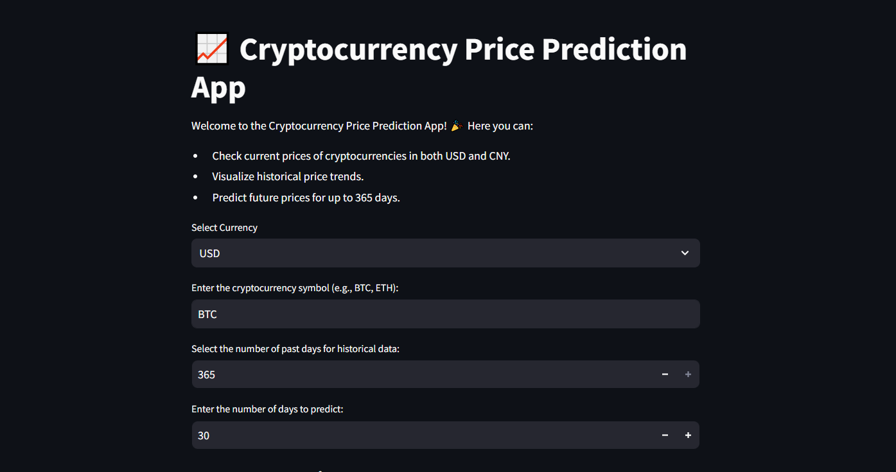

# Cryptocurrency Price Prediction App

Welcome to the Cryptocurrency Price Prediction App! This application allows you to check current prices of cryptocurrencies in both USD and CNY, visualize historical price trends, and predict future prices for up to 365 days.

## Features

- **Current Prices**: Check the current prices of cryptocurrencies in both USD and CNY.
- **Historical Data**: Visualize historical price trends for the past 30 to 365 days.
- **Data Export**: Export historical and predicted price data as a CSV and PDF file.
- **Download Option**: Download the historical and predicted price data directly from the app.

## ScreenShots



## Getting Started

### Prerequisites

- Python 3.7 or later
- Streamlit
- Pandas
- NumPy
- Scikit-learn
- Requests
- Pycoingecko
- Altair
- [Exchange API](https://github.com/fawazahmed0/exchange-api)
- reportlab

### Installation

1. Clone the repository:

   ```bash
   git clone https://github.com/scorpionTaj/Cryptocurrency-Price-Prediction.git
   cd cryptocurrency-price-prediction
   ```

2. Install the required dependencies:

   ```bash
   pip install -r requirements.txt
   ```

### Usage

1. Run the Streamlit app:

   ```bash
   streamlit run app.py
   ```

2. Open your web browser and navigate to the provided local URL (usually `http://localhost:8501`).

3. Use the sidebar to input the cryptocurrency symbol, select the number of historical days, and specify the number of days to predict.

4. View the current prices, historical price trends, and predicted prices.

5. Optionally, export the data as a CSV file by clicking the "Export Data as CSV" button.

## Developer Info

- **Developer**: Aether Crest

- **Email**: [My eamil](vijaiaaravindh.v10@gmail.com)

This app is built with ❤️ using **Streamlit**.

## Contributing

Contributions are welcome! Please feel free to open an issue or submit a pull request.

## Contact

For any questions or feedback, please contact via email.

---

Enjoy using the Cryptocurrency Price Prediction App! 🎉
